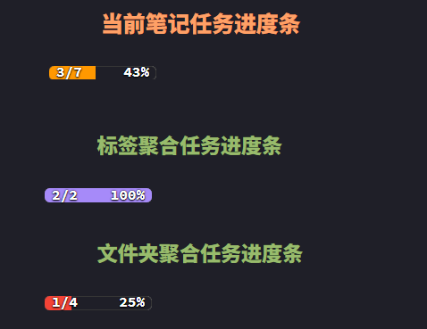

# ProgressBar Inline

一个为 Obsidian 设计的进度条插件，支持属性/任务进度统计，支持标签/文件夹聚合，兼容 Dataview 行内 JS 语法，进度条分段单色，100% 为紫色。

## 功能特性

- 支持当前笔记、标签、文件夹的属性进度条
- 支持当前笔记、标签、文件夹的任务进度条
- 进度条分段单色（红橙黄绿，100%为紫色）
- 支持 `$=` 行内 JS 语法，兼容 Dataview 插件
- 轻量、无依赖、易用

## 安装方法

1. 下载本仓库main.js，manifest.json 和 styles.css 到你的 Obsidian 插件目录 `.obsidian/plugins/progressbar-inline/`
2. 启用本插件和 Dataview 插件
3. 下载Snippets/ProgressBar Inline.css文件放在`.obsidian/Snippets/`,在 Obsidian 设置 → 外观 → 样式片段，启用 `ProgressBar Inline.css`

## 用法示例

### 1. 当前笔记属性进度条

在 YAML/frontmatter 里写：

```markdown
---
Progress: 2
Target: 3
---
```

在正文任意位置插入：

```markdown
`$=pb(dv.current().Progress, dv.current().Target)`
```
效果：
进度条居中显示百分比，颜色根据进度自动变化。

### 2. 当前笔记任务进度条

```markdown
`$=tb(dv.current().file.tasks.filter(t => t.completed).length,dv.current().file.tasks.length)`
```
效果：
进度条左侧叠加显示完成数/总数，右侧显示百分比，颜色根据进度自动变化。

### 3. 标签/文件夹聚合进度条

#### 标签聚合属性进度条

```markdown
`$=(()=>{let p=0,t=0;for(let x of dv.pages('#你的标签')){p+=+x.Progress||0;t+=+x.Target||0}return pb(p,t)})()`
```

#### 文件夹聚合属性进度条

```markdown
`$=(()=>{let p=0,t=0;for(let x of dv.pages('"你的/文件夹路径"')){p+=+x.Progress||0;t+=+x.Target||0}return pb(p,t)})()`
```

#### 标签聚合任务进度条

```markdown
`$=(()=>{let d=0,a=0;for(let x of dv.pages('#你的标签')){if(x.file&&x.file.tasks){for(let t of x.file.tasks){a++;if(t.completed)d++;}}}return tb(d,a)})()`
```

#### 文件夹聚合任务进度条

```markdown
`$=(()=>{let d=0,a=0;for(let x of dv.pages('"你的/文件夹路径"')){if(x.file&&x.file.tasks){for(let t of x.file.tasks){a++;if(t.completed)d++;}}}return tb(d,a)})()`
```

## 进度条颜色说明

- 0%-25%：红色
- 26%-50%：橙色
- 51%-75%：黄色
- 76%-99%：绿色
- 100%：紫色

## 效果预览

属性进度条示例：  


任务进度条示例：  


## 兼容性

- 需要 Obsidian 1.8.9 及以上版本
- 需要 Dataview 插件

## License

MIT

---

**欢迎反馈建议与贡献！**